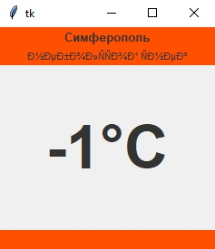
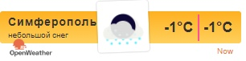

<p align="center">МИНИСТЕРСТВО НАУКИ  И ВЫСШЕГО ОБРАЗОВАНИЯ РОССИЙСКОЙ ФЕДЕРАЦИИ<br>
Федеральное государственное автономное образовательное учреждение высшего образования<br>
"КРЫМСКИЙ ФЕДЕРАЛЬНЫЙ УНИВЕРСИТЕТ им. В. И. ВЕРНАДСКОГО"<br>
ФИЗИКО-ТЕХНИЧЕСКИЙ ИНСТИТУТ<br>
Кафедра компьютерной инженерии и моделирования</p>
<br>

<h3 align="center">Отчёт по лабораторной работе № 1<br> по дисциплине "Программирование"</h3>
<br><br>
<p>студента 1 курса группы ИВТ-б-о-201(1)<br>
Бывшего Сергея Валентиновича<br>
направления подготовки 09.03.01 "Информатика и вычислительная техника"</p>

<br><br>

<table>
<tr><td>Научный руководитель<br> старший преподаватель кафедры<br> компьютерной инженерии и моделирования</td>
<td>(оценка)</td>
<td>Чабанов В.В.</td>
</tr>
</table>
<br><br>
<p align="center">Симферополь, 2020</p>
<hr>


## <p align="center"> Лабораторная работа №1 Погода </p>
## Цель: 
Закрепить навыки разработки многофайловыx приложений;<br>
Изучить способы работы с API web-сервиса;<br>
Изучить процесс сериализации/десериализации данных в/из json;<br>
Получить базовое представление о сетевом взаимодействии приложений;<br>


## Постановка задачи
Разработать сервис предоставляющий данные о погоде в городе Симферополе на момент запроса.  В качестве источника данных о погоде используйте: http://openweathermap.org/. В состав сервиса входит: серверное приложение на языке С++ и клиентское приложение на языке Python.

Серверное приложение (далее Сервер) предназначенное для обслуживания клиентских приложений и минимизации количества запросов к сервису openweathermap.org. Сервер должен обеспечивать возможность получения данных в формате JSON и виде html виджета (для вставки виджета на страницу будет использоваться iframe).

Клиентское приложение должно иметь графический интерфейс отображающий сведения о погоде и возможность обновления данных по требованию пользователя.


## Ход работы

Для получения API Key я зарегистрировался на сайте http://openweathermap.org/. После регистрации в разделе<br>
My API Keys,воспользовался пунктом "Create Key" и я сгенерировал API Key. 

> Мой API Key: e8b313f86318658f663576135d7ed415.

В ходе лабораторной работы, был изучен формат составления запросов к сервису openweathermap.org. Были изучены примеры работы использования API на официальном сайте сервиса: http://openweathermap.org/appid#use.
Составил запрос на получение прогноза погоды для Симферополя с почасовым интервалом, в градусах Цельсия, на русском языке;

> Запрос: http://openweathermap.org/data/2.5/onecall?lat=44.9&lon=34.1&exclude=daily&units=metric&lang=ru&appid=e8b313f86318658f663576135d7ed415

Протестировал запрос в браузере. Ответ изучил в виде дерева, при помощи https://jsonviewer.io/tree.

Составил запрос для получения времени в Симферополе при помощи сервиса worldtimeapi.org и изучил формат ответа: 

> Запрос: http://worldtimeapi.org/api/timezone/Europe/Simferopol

Для запуска сервера, был использован язык C++, а также сторонние библиотеки: httplib (для работы с HTTP-клиентом и HTTP-сервером), JSON for Modern C++ (позволяет работать с JSON-файлами).

Полный исходный код серверного приложения;

```C++
#include <iostream>
#include <string>
#include <nlohmann/json.hpp>
#include <cpp_httplib/httplib.h>
#include <locale>
using json = nlohmann::json;
using namespace std;
using namespace httplib;

json weather;

void get_w()
{
	Client cli_wet("api.openweathermap.org");
	auto wet = cli_wet.Get("/data/2.5/onecall?lat=44.9&lon=34.1&exclude=daily&units=metric&lang=ru&appid=e8b313f86318658f663576135d7ed415");
	weather = json::parse(wet->body);
	ofstream wet_cache("cache.json");
	wet_cache << weather;
	wet_cache.close();
}
int findtime(int current_time)
{
	int ftime = -1;
	for (int i = 0; i < weather["hourly"].size(); i++) {

		if (current_time < weather["hourly"][i]["dt"])
		{
			ftime = i;
			break;
		}
		ftime = -1;
	}
	return ftime;
}
void raw_response(const Request& req, Response& res) {
	Client time_cli("http://worldtimeapi.org");
	auto time = time_cli.Get("/api/timezone/europe/simferopol");
	json j = json::parse(time->body);
	int current_time = j["unixtime"];
	ifstream wet_caсhe("cache.json");
	string wet_str = "";
	getline(wet_caсhe, wet_str, '\0');
	weather = json::parse(wet_str);
	wet_caсhe.close();
	int ftime = findtime(current_time);
	if (ftime == -1)
	{
		get_w();
		ftime = findtime(current_time);
	}
	string distr = weather["hourly"][nice_time]["weather"][0]["description"];
	string temp = to_string(int(weather["hourly"][nice_time]["temp"]));
	string str = "{\"pogoda\":\"" + distr + "\",\"temp\":" + temp + "}";
	res.set_content(str, "text/json");
}
string trade(string f, string s, string t)
{
	std::locale::global(std::locale(""));
	size_t pos;
	while ((pos = f.find(s)) != std::string::npos)
	{
		f.erase(pos, s.size());
		f.insert(pos, t));
	}
	return f;
}
void gen_response(const Request& req, Response& res) {
	Client time_cli("http://worldtimeapi.org");
	auto time = time_cli.Get("/api/timezone/europe/simferopol");
	json j = json::parse(time->body);
	int current_time = j["unixtime"];
	if (time) {
		if (time->status == 200) {

		}
		else {
			std::cout << "Status code: " << time->status << std::endl;
			string str = "Status code : " + to_string(time->status);
			res.set_content(str, "text/plain");
		}
	}
	else {
		auto err = time.error();
		std::cout << "Error of time code: " << err << std::endl;
		string str = "Error of time code: " + to_string(err);
		res.set_content(str, "text/plain");
	}
	ifstream wet_caсhe("cache.json");
	string wet_str = "";
	getline(wet_caсhe, wet_str, '\0');
	weather = json::parse(wet_str);
	wet_caсhe.close();
	int ftime = findtime(current_time);
	if (ftime == -1)
	{
		get_w();
		ftime = findtime(current_time);
	}
	ifstream file;
	file.open(R"(include/Widget.html)");
	if (!file.is_open())
	{
		cout << "Error.Template" << endl;
		res.set_content("Error.Template", "text/plain");
	}
	else {

		string str = "", str_p = "";
		while (!file.eof())
		{
			str_p = "";
			getline(file, str_p);
			str += str_p;
		}
		file.close();

		string distr = weather["hourly"][nice_time]["weather"][0]["description"];
		string temp = to_string(int(weather["hourly"][nice_time]["temp"]));
		string icon = weather["hourly"][nice_time]["weather"][0]["icon"];
		str = trade(str, "{hourly[i].weather[0].description}", distr);
		str = trade(str, "{hourly[i].weather[0].icon}", icon);
		str = trade(str, "{hourly[i].temp}", temp);
		res.set_content(str, "text/html");
	}
}
int main() {

	Server svr;
	svr.Get("/", gen_response);
	svr.Get("/raw", raw_response);
	std::cout << "start\n";
	svr.listen("localhost", 3000);
}
```

Для создания клиентского приложения использовался язык Python. Использовал библиотеки requests и json.

Полный исходный код клиентского приложения;

```Python
from tkinter import *
import requests
from requests.exceptions import InvalidSchema

def new_wet(event):
	try:
		weather = requests.get('http://localhost:3000/raw', headers={'Content-type': 'text/json; charset=UTF-8'}).json()
	except InvalidSchema:
		print('Can\'t connect to server. Exit')
		exit()
	temp = str(weather['temp']).split('.')[0]
	pogoda["text"]=weather['pogoda']
	temperature["text"]=(temp + '°C')
	print("New weather printed \n")
	pass

try:
	weather = requests.get('http://localhost:3000/raw', headers={'Content-type': 'text/json; charset=UTF-8'}).json()
except InvalidSchema:
	print('Can\'t connect to server. Exit')
	exit()
root = Tk()

temp = str(weather['temp']).split('.')[0]
top = Frame(root, background="#ff4f00")
top.pack(side=TOP, fill=X)
middle = Frame(root, background="white")
middle.pack(side=TOP, fill=BOTH)
bottom = Frame(root, background="#ff4f00")
bottom.pack(side=BOTTOM, fill=X)
Label(top, 
	text="Симферополь", 
	bg="#ff4f00", 
	fg="#333333",
	font=('sans-serif', 10, 'bold')).pack(fill=X)
pogoda=Label(top, 
	text=weather['pogoda'], 
	bg="#ff4f00", 
	fg="#333333",
	font=('sans-serif', 8))
temperature=Label(middle, 
	text=(temp + '°C'), 
	padx=50, 
	pady=50,
	fg="#333333",
	font=('sans-serif', 50, 'bold'))
Label(bottom, bg="#ff4f00").pack(fill=X)
pogoda.pack(fill=X)
temperature.pack(fill=X)
root.bind("<Button-3>",new_wet)

root.mainloop()
```


Скриншот графического интерфейса клиентского приложения.

<br>

Рис.1 Графический интерфейс на Tkinter


Скриншот браузера с загруженными виджетом.

<br>

Рис.2 Виджет.

## Вывод: 

Получил навыки создания многофайловых приложений, создания графического интерфейса с помощью tkinter. Изучил процесс парсинга значений с помощью json-библиотеки. Исследовал методы работы с API-сервисами worldtimeapi и openweathermap. Изучил работу со строками в языке C++, получил базовое представление о сетевом взаимодействии приложений.